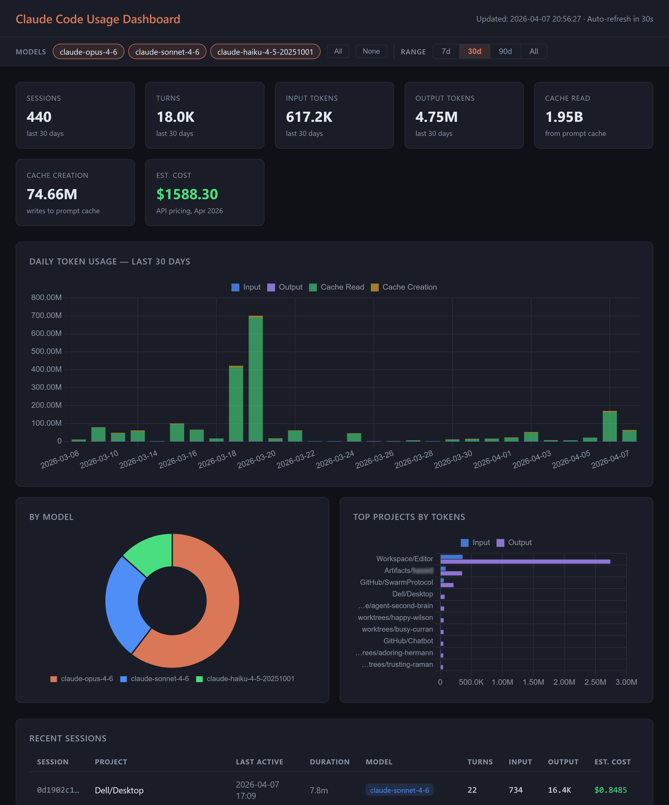

# Claude Code Usage Dashboard

[](LICENSE)
[](https://claude.ai/code)

**A self-contained, zero-dependency local dashboard for your Claude Code token usage and estimated costs.**

Claude Code writes detailed usage logs locally — token counts, models, sessions, projects — regardless of your plan. This dashboard reads those logs and turns them into charts and cost estimates. Works on API, Pro, and Max plans.

The dashboard ships as a **single Python file** (`my_dashboard.py`). No `pip install`, no Node, no external JS libraries — the charts are drawn with the HTML Canvas API and the HTML/CSS/JS is inlined directly in the server.



---

## What this tracks

Captures usage from:
- **Claude Code CLI** (`claude` command in terminal)
- **VS Code extension** (Claude Code sidebar)
- **Dispatched Code sessions** (sessions routed through Claude Code)

**Not captured:**
- **Cowork sessions** — these run server-side and do not write local JSONL transcripts

---

## Requirements

- Python 3.8+
- No third-party packages — uses only the standard library (`sqlite3`, `http.server`, `json`, `pathlib`)

> Anyone running Claude Code already has Python installed.

## Quick start

No `pip install`, no virtual environment, no build step.

```bash
git clone https://github.com/sylvastudio/claude-usage-dashboard
cd claude-usage-dashboard
python3 my_dashboard.py        # use `python` on Windows
```

This will:

1. Scan your Claude Code logs and build/update `~/.claude/usage.db`
2. Start a local web server (default `http://localhost:8080`)
3. Open the dashboard in your browser

Stop with `Ctrl+C`. The dashboard re-scans the logs on every data refresh, so reloading the page always shows your latest usage.

### Configuration

| Env var | Default | Description |
|---------|---------|-------------|
| `HOST`  | `localhost` | Interface to bind |
| `PORT`  | `8080`      | Port to serve on |

```bash
HOST=0.0.0.0 PORT=9000 python3 my_dashboard.py
```

The scanner is incremental — it tracks each file's path and modification time, so each scan only processes new or changed files.

---

## How it works

Claude Code writes one JSONL file per session to `~/.claude/projects/`. Each line is a JSON record; `assistant`-type records contain:
- `message.usage.input_tokens` — raw prompt tokens
- `message.usage.output_tokens` — generated tokens
- `message.usage.cache_creation_input_tokens` — tokens written to prompt cache
- `message.usage.cache_read_input_tokens` — tokens served from prompt cache
- `message.model` — the model used (e.g. `claude-sonnet-4-6`)

`scanner.py` parses those files into a SQLite database at `~/.claude/usage.db`. `my_dashboard.py` scans on startup, then serves a single-page dashboard with Canvas-drawn charts, per-model breakdowns, and per-project / per-session tables.

---

## Cost estimates

Costs are estimated from token counts using per-million-token pricing for the **Opus**, **Sonnet**, and **Haiku** tiers (input, output, cache-write, and cache-read priced separately). Only models whose name contains `opus`, `sonnet`, or `haiku` are included; anything else is excluded from cost totals.

| Tier | Input | Output | Cache Write | Cache Read |
|------|-------|--------|-------------|------------|
| Opus   | $5.00/MTok | $25.00/MTok | $6.25/MTok | $0.50/MTok |
| Sonnet | $3.00/MTok | $15.00/MTok | $3.75/MTok | $0.30/MTok |
| Haiku  | $1.00/MTok | $5.00/MTok  | $1.25/MTok | $0.10/MTok |

Pricing lives in the `PRICING` table at the top of `my_dashboard.py` and is easy to adjust.

> These are **estimates** for personal tracking based on API prices. If you use Claude Code via a Max or Pro subscription, your actual cost structure is subscription-based, not per-token. Always defer to your official Anthropic billing.

---

## Files

| File | Purpose |
|------|---------|
| `my_dashboard.py` | Standalone dashboard server (scan + serve, zero deps) |
| `scanner.py` | Parses JSONL transcripts into `~/.claude/usage.db` |

---

## License

MIT — see [LICENSE](LICENSE). Builds on the upstream
[`phuryn/claude-usage`](https://github.com/phuryn/claude-usage) project.
